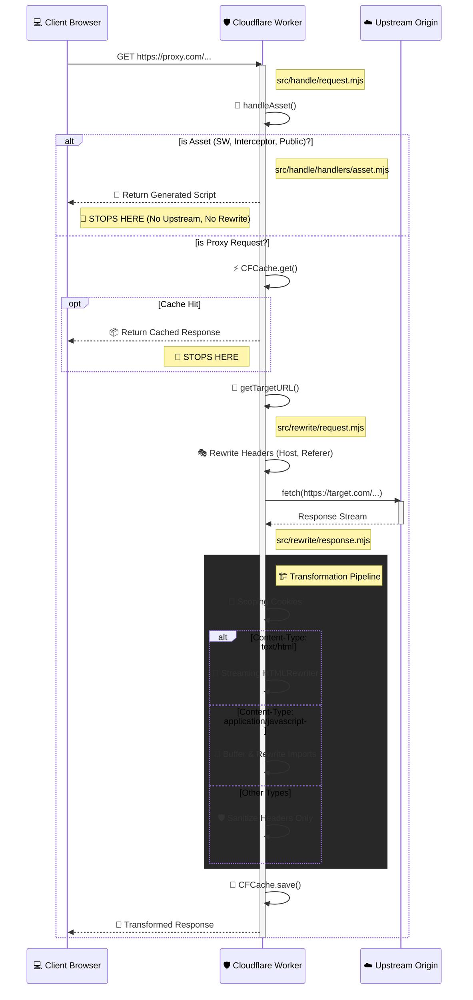

```mermaid
sequenceDiagram
    participant Client as 💻 Client Browser
    participant Proxio as 🛡️ Cloudflare Worker
    participant Origin as ☁️ Upstream Origin

    Client->>Proxio: GET https://proxy.com/...
    
    activate Proxio
    Note right of Proxio: src/handle/request.mjs
    
    %% 1. Asset Handling (Early Exit)
    Proxio->>Proxio: 📂 handleAsset()
    
    alt is Asset (SW, Interceptor, Public)?
        Note right of Proxio: src/handle/handlers/asset.mjs
        Proxio-->>Client: 📜 Return Generated Script
        Note left of Proxio: 🛑 STOPS HERE (No Upstream, No Rewrite)
    
    else is Proxy Request?
        %% 2. Cache Layer
        Proxio->>Proxio: ⚡ CFCache.get()
        
        opt Cache Hit
            Proxio-->>Client: 📦 Return Cached Response
            Note left of Proxio: 🛑 STOPS HERE
        end
        
        %% 3. Target Resolution
        Proxio->>Proxio: 🎯 getTargetURL()
        
        %% 4. Request Rewriting
        Note right of Proxio: src/rewrite/request.mjs
        Proxio->>Proxio: 🎭 Rewrite Headers (Host, Referer)
        
        %% 5. Upstream Fetch
        Proxio->>Origin: fetch(https://target.com/...)
        activate Origin
        Origin-->>Proxio: Response Stream
        deactivate Origin

        %% 6. Transformation Engine
        Note right of Proxio: src/rewrite/response.mjs
        
        rect rgb(40, 40, 40)
            Note right of Proxio: 🏗️ Transformation Pipeline
            Proxio->>Proxio: 🍪 Scoping Cookies
            
            alt Content-Type: text/html
                Proxio->>Proxio: 🌊 Streaming HTMLRewriter
            else Content-Type: application/javascript
                Proxio->>Proxio: 📜 Buffer & Rewrite Imports
            else Other Types
                Proxio->>Proxio: 🛡️ Sanitize Headers Only
            end
        end

        Proxio->>Proxio: 💾 CFCache.save()
        Proxio-->>Client: 🚀 Transformed Response
    end
    deactivate Proxio
```